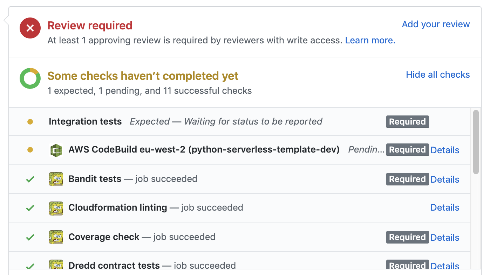
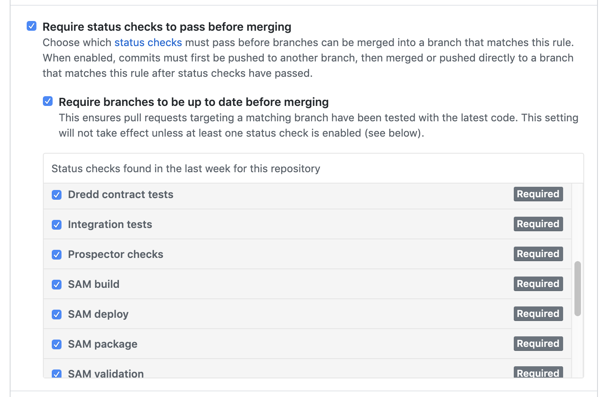

[](https://www.gridsmartercities.com/)

![Build Status][build-status]
[![License: MIT][mit-license-svg]][mit-license]
![Github Release][release]

# python-serverless-template

This is a Github Template to generate Serverless APIs (and more) in Python using AWS SAM.
 
This template does not use the fantastic [Serverless Framework][serverless-framework]. You might want to look at it too.

This template is opinionated, and makes use of:

- [AWS SAM][sam] for the AWS resourses specification.
- [AWS codebuild][codebuild] to setup CI/CD in your AWS account.
- [cfn-python-lint][cfn-python-lint] for checking the cloudformation template.
- [OpenApi 3][openapi-3] for the API contract specification.
- The [Swagger CLI][swagger-cli] to validate the OpenAPI specification.
- The Python [unittest][unittest] library for unit testing.
- [Coverage][coverage], to ensure the Python code is 100% unit tested
- [Prospector][prospector], a python tool to check code quality.
- [pylint_quotes][pylint-quotes], a [pylint][pylint] plugin to ensure a consistent Python quotation style throughout the project.
- [Bandit][bandit], a security testing tool.
- [Dredd][dredd], for contract testing against the OpenAPI definition, with hooks written in Python.
- A custom packaging tool to ease the sharing of code between [lambda functions][lambda] by using [lambda layers][lambda-layers].
- A custom tool to notify GitHub of build progress on each build command.


## Project Set up

- Install AWS CLI, and AWS SAM CLI following [these instructions][aws-sam-cli-installation].
- Create a Github repo by clicking on the GitHub *Use this template* button above.
- Create a Personal Access Token in your GitHub account.
    - In GitHub, go to your *Settings*, then *Developer Settings* and finally *Personal access token*.
    - Click on *Generate new token*.
    - Select all *repo* options.
    - Click on the *Generate token* button.
    - Copy the generated hash value (you will not be able to see it again). This is your GitHub Token.
- Clone repository to your computer, and change all references to *python-serverless-template* to *your-service-name*.
- [Create three AWS accounts][aws-account-create] if you don't have them ready. You'll need an account for development (dev), staging (stg) and production (prod), although you could just start with a dev account for now and ignore all steps for seting up stg and prod below.
- Ensure AWS has access to your GitHub account.
    - In your AWS account, go to *Services* and type *codebuild*.
    - In the *Build Projects*, Click the *Create build project* button.
    - Go to the *Source* section, and select *GitHub* as the Source Provider.
    - Ensure *Connect using OAuth* is selected, and click on the *Connect to GitHub* button.
    - Click the *Cancel* button to exit. Your AWS account can now access your GitHub account. 
- In your Dev AWS Account, run the *setup-template.yaml* stack to create the CI/CD build project.
    - Go to *Services* and type *cloudformation*.
    - In the *Stacks* section, click on the *Create stack* button.
    - In the *Specify Template* section, select *Upload a template file*.
    - Click on the *Choose file* button, and select the *setup-template.yaml* cloudformation template located in this repository.
    - Click on *Next*.
    - Enter a stack name (for example, your-service-name-stack-setup)
    - In the *Parameters* section, enter:
        - The name of your service (for example, *your-service-name*). 
        - The email address where staging build errors should be sent to.
        - For Environment, select "dev"
        - You can leave the "Related Account Id" field empty for the dev stack.
        - The GitHub Owner (for example, for repo https://github.com/gridsmartercities/python-serverless-template.git, it would be *gridsmartercities*)
        - The GitHub Repo name (for repo https://github.com/gridsmartercities/python-serverless-template.git, it would be *python-serverless-template*)
        - Enter the GitHub token you generated before.
        - For Build Region, enter your current AWS region.
    - Click *Next*.
    - Accept the *Capabilities and transforms* options at the bottom of the page, and click the *Create stack* button.
    - Wait until the stack is created.
- Update the *dev* webhook in Github to trigger the AWS codebuild on Pull Requests only:
    - In your AWS account, got to *Services* and type *codebuild*.
    - Select the dev codebuild project.
    - Select the *Build details* tab.
    - In the *Primary source webhook events* section, click the external webhook link to go to GitHub. 
    - In the *Which events would you like to trigger this webhook?* select *Let me select individual events.* and tick the *Pull requests* box only.
    - Click on *Update webhook* at the bottom.
- If you have a Stg account, run the *setup-template.yaml* stack there in the same way you ran the stack in the dev account but with these value differences:
    - In the *Parameters* section, enter the same values as in "dev", except:
        - "stg" as environment.
        - The value of "Related Account Id" is the AWS Account Id of your Prod account.
- Update the *stg* webhook in Github to trigger the AWS codebuild on Push to the master branch only. 
    - Follow the instructions in the previous point, but for the *stg* codebuild project and webhook.
    - In the *Which events would you like to trigger this webhook?* select *Just the push event* option.
    - Click on *Update webhook* at the bottom.
- If you have a Prod account, run the *setup-template.yaml* stack there in the same way you ran the stack in the dev account but with these value differences:    
    - In the *Parameters* section, enter the same values as in "dev", except:
        - "prod" as environment.
        - The value of "Related Account Id" is the AWS Account Id of your Stg account.
- Note: there is no webhook for the prod account. The Prod build will automatically be triggered by a successful run of the Stg build (using the related account Ids and Build region parameter values).
- (Optional) To stop contributors from committing code directly to the master branch, setup a master branch protection rule in GitHub. Only peer reviewed, approved Pull Requests will be allowed to be merged into the master branch.
    - in your GitHub account, select *Settings*.
    - Go to the *Branches* section, and click on *Add rule*
    - In the Branch name pattern, enter *master*
    - In the Rule settings:
        - select *Require pull request reviews before merging*, and *Dismiss stale pull request approvals when new commits are pushed*.
        - select *Require status checks to pass before merging*, and *Require branches to be up to date before merging*. After running your first build (when raising your first Pull Request), you should be able to make the codebuild run (and any other build commands run via the update-commit-status.sh tool) required in the *status checks* area of this section.
        - select *Include administrators*.
        - click on the *Create* button.
        
#### A note on permissions

As you add AWS services to your project, you will likely need to update the codebuild policies to allow for the creation of those new resources (dynamodb tables, sqs, sns, ...)

#### A note on costs

- [Codebuild has a cost][codebuild-cost] of around $1 per 200 build minutes beyond the first 100 free-tier minutes.
- You might need a GitHub Pro ($7 per month) account to setup branch protection rules.

## Developer Set up

To follow these instructions, you will need to be familiar with pip, and creating and managing Python virtual environments. If you are not, take a look at [this][pip-and-ve].

- Create a Python virtual environment.
- Install the development requirements by running

```pip install -r requirements.txt```

- Install the swagger cli by running

```npm install swagger-cli```

- Take a look at the [Project Structure](#Project-Structure) section below, and start writing your code.
- (Optional) Set a pre-build-checks Git hook to check your code before pushing it to your Github branch:
    - Copy pre-build-checks script to .git/hooks folder:
    
    ```cp tools/build/pre-build-checks.sh .git/hooks/pre-push```
    
    - Give execute permissions to pre-push script:
    
    ```chmod u+x .git/hooks/pre-push```
    
## Project Structure

### Code

The source code is located in the src folder. All code shared by more than 1 lambda should be placed in files in that directory (or subfolders in that directory) following the Single Responsibility and Interface Segregation principles.

Each lambda has its own folder inside src, which contains the lambda code itself and an optional requirements.txt file with a list of external dependencies the lambda needs.

### Tests

Unit and contract tests are inside the tests folder, and follows the same structure as the code. Unit tests are placed in files starting with *test_* (for *unittest* discovery), and contract tests are written as [Dredd hooks][dredd-hooks].

Integration tests are separated into their own *it* folder.

### Config Files

The .prospector.yaml and .pylintrc files allows you to change the way prospector runs. Other than forcing 120 characters per line, and the use of double quotes instead of single quotes (using the [pylint_quotes][pylint-quotes] plugin), the config files have the out of the box configuration for those tools. 

### Buildspec Files

Three buildspec files are included, one for the *dev* build, one for the *stg* (Staging) build, and one for the *prod* build.

The *dev* build will be triggered when a Pull Request occurs in Github. The *stg* build will be triggered when a Pull Request is merged into the master branch. The *prod* build will be automatically triggered when a *stg* build runs successfully.

### API Contract Specification

You can define your API contract in *api-contract.yaml*, as per the [OpenApi 3.0 specification][openapi-3].

### SAM template

You can define your AWS resources in *template.yaml*, as per AWS's [Serverless Application Model][sam].

### Tools

#### [unit-tests.sh][tool-unit-tests]
 
Runs all unit tests

```./unit-tests.sh```

#### [test.sh][tool-test]

Runs an individual unit test

```./test.sh tests.a_lambda.test_a_lambda.ALambdaTests.test_success```

#### [coverage.sh][tool-coverage]

Runs test coverage 

```./coverage.sh```

#### [pre-build-checks.sh][tool-pre-build-checks]

Runs swagger validation, cloudformation template validate, bandit, prospector, unittest and coverage in one command

```./pre-build-checks.sh```

#### [lambda_layer.sh][tool-lambda-layer]

This is a custom build tool that structures the code in a way that can be added to a lambda layer (which is a resource in template.yaml). This tool is used by the build process only.

Please note that if you run this packager locally, the .build folder might make the Bandit tests to take quite a lot of time. You might want to delete the .build folder once you've taken a look at it.

#### [stack-remover.sh][tool-stack-remover]

This build tool is used to remove all the left over PR related cloudformation stacks in AWS. At the end of a staging build, the process picks a list of all the PR related stacks in CREATE_COMPLETE state and, from those, it deletes the ones that do not belong to an open PR in GitHub.

#### [get-api-url.sh][tool-get-api-url]

Allows the build to get the AWS API URL from the API Name. 

#### [update-commit-status.sh][tool-update-commit-status]

This build tool creates a commit status of *pending* in the current GitHub commit before running a command in the [buildspec-dev.yaml][buildspec-dev] file (look for a $TAG line in the buildspec for an example). A success or failure status is then created after the command runs, depending on the outcome of the run. In this way, you get instant feedback of the build progress in GitHub:
 

 
You can also make some (or all) of these steps required in GitHub, by going to *Branches* in the *Settings* section in GitHub and adding (or updating) a branch protection rule (on the master branch):



## How to work on the project

1. Change to master branch: 

```git checkout master```

2. Pull the code from the remote repo: 

```git pull```

3. Create a new branch: 

```git checkout -b your_new_feature_branch_name```

4. make your feature changes
5. run checks with the pre-build-checks, unit-tests, test or coverage tools, or run them individually (swagger, cfn-lint, cloudformation validation, bandit, prospector, unittest, coverage - you can find the commands in the buildspec-dev.yaml file, and in the pre-build-checks script).
6. Push to remote repo: 

```git push```
 
or 

```git push -u origin your_new_feature_branch_name```
 
 if this is the first push (it will trigger an automatic pre-build-checks check if you have configured the optional point 5 of the developer set up process).
 
7. Repeat 4-6 as many times as needed. When finished, raise a PR in GitHub. This will trigger a build of the *dev* codebuild project in your AWS account.
8. If the build is green in GitHub, get your code reviewed (and approved if ok) by another contributor
9. If approved, rebase and merge into master. This will trigger a build of the *stg* codebuild project in your AWS account, which will alert you by email in case of failure.
10. To work on a new feature, repeat 1-9.

## How to add a new API Gateway endpoint backed by a lambda function

You can add a new endpoint (or a method to an endpoint) in the *api-contract.yaml*. 

You can define your AWS Function resource (and any other resources needed: database, roles, policies, ...) in the *template.yaml* SAM template.

Create a folder with the same name in the tests folder, and add a python file with a *test_* name to it. Start writing your unit tests there. Add a *hooks.py* file too if this lambda function needs to be contract tested (and you need to specify some dredd hooks).

Create a new folder with the name of your feature inside the *src* folder, and add a python file with an appropriate name to it. In this python file, define your lambda function handler.

If that lambda needs an external library, add a requirements.txt file to the lambda folder, and specify the dependencies there.

### To run dredd locally:

- Install dredd locally by running

```npm install dredd```

- After creating a Pull Request, go to your AWS codebuild project and take a look at the BASE_URL in the codebuild logs (you can also get it from ApiGateway)
- Add the BASE_URL to your local environment variables by running 

```export BASE_URL=your-base-url-from-codebuild```

- Run dredd by typing 

```dredd api-contract.yaml $BASE_URL --hookfiles=tests/hooks.py --hookfiles=tests/*/hooks.py --language python```
    
# A Note on __init__ files in the tests folder

The unittest library needs at least one __init__ at the tests folder root level.

Prospector works fine if you have no __init__ files, or if you have __init__ files in every folder, but it does not like having just one __init__ (it will miss some issues on those folders).

Until the unittest library is fixed (and no __init__ files are needed), __init__ are needed in all tests folders.

    
[build-status]: https://codebuild.eu-west-2.amazonaws.com/badges?uuid=eyJlbmNyeXB0ZWREYXRhIjoiYWNqUHZHVUFaR0NWYUtsYndvUWVkbGkyL240OCtYVlBMaVJ3SkU2cVZYN1hKeVRtdkllSHU4ZDlCdzJsK1NSczYxVCtXVGZhSEs2QkxzTWlpYlpDdnJBPSIsIml2UGFyYW1ldGVyU3BlYyI6Ik1haWpIZE5RYlNGWS9vZnUiLCJtYXRlcmlhbFNldFNlcmlhbCI6MX0%3D&branch=master
[mit-license-svg]: https://img.shields.io/badge/License-MIT-yellow.svg
[mit-license]: https://opensource.org/licenses/MIT
[release]: https://img.shields.io/github/release/gridsmartercities/python-serverless-template.svg?style=flat
[serverless-framework]: https://serverless.com/
[sam]: https://aws.amazon.com/serverless/sam/
[codebuild]: https://aws.amazon.com/codebuild/
[openapi-3]: https://github.com/OAI/OpenAPI-Specification/blob/master/versions/3.0.0.md
[swagger-cli]: https://www.npmjs.com/package/swagger-cli
[unittest]: https://docs.python.org/3/library/unittest.html
[coverage]: https://coverage.readthedocs.io/en/v4.5.x/
[prospector]: https://prospector.readthedocs.io/en/master/
[pylint-quotes]: https://github.com/edaniszewski/pylint-quotes
[pylint]: https://www.pylint.org/
[bandit]: https://bandit.readthedocs.io/en/latest/
[dredd]: https://github.com/apiaryio/dredd
[codebuild-badge]: https://codebuild.eu-west-2.amazonaws.com/badges?uuid=eyJlbmNyeXB0ZWREYXRhIjoiTnE5ck1FRWpyK25SVm1tMTdnT3RBUENsRzBLWDREYjJ0ZUZsTkNacVAxMFFhUmxDaWxkeE43MWU1cnlzNnNESGw3QzJTdzduU25vVUFNaDN3UEE5bzFBPSIsIml2UGFyYW1ldGVyU3BlYyI6InB2LzE2MGRLY3czVXpmdlQiLCJtYXRlcmlhbFNldFNlcmlhbCI6MX0%3D&branch=master
[codebuild-cost]: https://aws.amazon.com/codebuild/pricing/
[aws-account-create]: https://aws.amazon.com/premiumsupport/knowledge-center/create-and-activate-aws-account/
[lambda]: https://docs.aws.amazon.com/lambda/latest/dg/welcome.html
[dredd-hooks]: https://dredd.org/en/latest/hooks/js.html
[pip-and-ve]: https://packaging.python.org/guides/installing-using-pip-and-virtual-environments/
[tool-unit-tests]: https://github.com/gridsmartercities/python-serverless-template/blob/master/tools/build/unit-tests.sh
[tool-test]: https://github.com/gridsmartercities/python-serverless-template/blob/master/tools/dev/test.sh
[tool-coverage]: https://github.com/gridsmartercities/python-serverless-template/blob/master/tools/dev/coverage.sh
[tool-pre-build-checks]: https://github.com/gridsmartercities/python-serverless-template/blob/master/tools/build/pre-build-checks.sh
[tool-lambda-layer]: https://github.com/gridsmartercities/python-serverless-template/blob/master/tools/build/lambda_layer.sh
[tool-stack-remover]: https://github.com/gridsmartercities/python-serverless-template/blob/master/tools/build/stack-remover.sh
[tool-get-api-url]: https://github.com/gridsmartercities/python-serverless-template/blob/master/tools/build/get-api-url.sh
[tool-update-commit-status]: https://github.com/gridsmartercities/python-serverless-template/blob/master/tools/build/update-commit-status.sh
[cfn-python-lint]: https://github.com/aws-cloudformation/cfn-python-lint
[buildspec-dev]: https://github.com/gridsmartercities/python-serverless-template/blob/master/buildspec-dev.yaml
[aws-sam-cli-installation]: https://docs.aws.amazon.com/serverless-application-model/latest/developerguide/serverless-sam-cli-install.html
[lambda-layers]: https://docs.aws.amazon.com/lambda/latest/dg/configuration-layers.html
